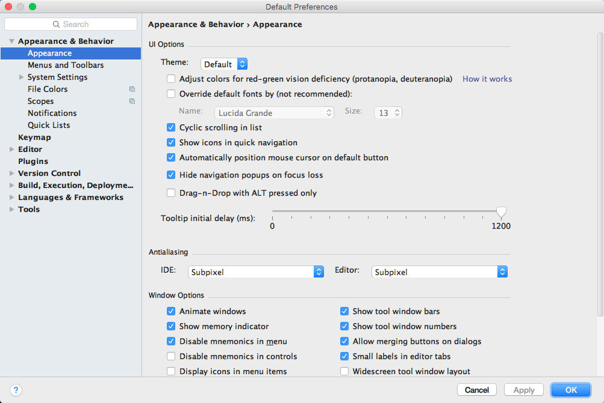
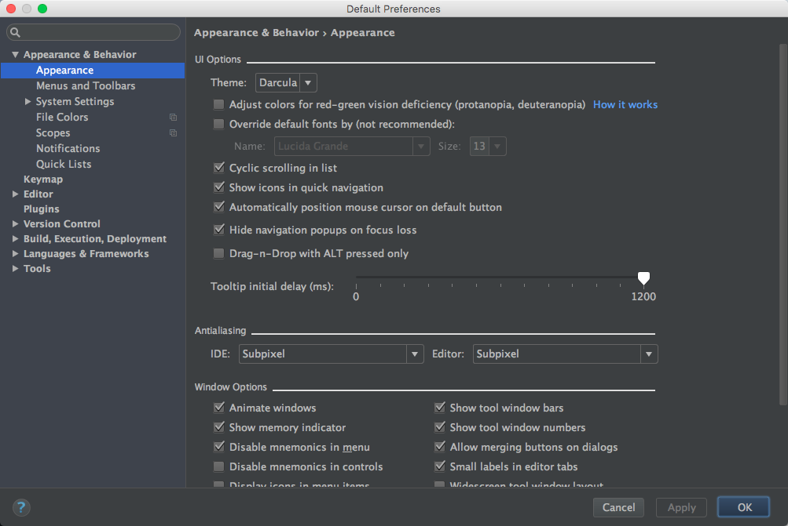

## UI Options(UI选项)

1.Theme(主题)

<<<<<<< HEAD
1.1 Default(默认的)

1.2 Darcula

2.Adjust colors for red-green vision deficiency(protanopia,deuteranopia)

>调整颜色红绿视觉缺陷(红色盲,绿色盲)

3.Override default fonts by (not recommeded)

>(覆盖默认字体(不确定推荐))

4.Cyclic scrolling in list

>(循环滚动的列表)

5.Show icons in quick navigation

>(在快速导航显示图标)

6.automatically position mouse cursor on default button

>(自动位置鼠标光标默认按钮)

7.Hide navigation popups on focus loss

>(隐藏导航弹出窗口焦点的损失)

8.Drag-n-Drop with ALT pressed only

>Drag-n-Drop与ALT按下

9.Tooltip initial delay(ms):

>工具提示初始延迟(ms):

## Antialiasing

>(抗锯齿)

1.Subpixel

>亚像素

2.Greyscale

>灰度

3.No antialiasing

>没有抗锯齿

## Window Options

>窗口选项

1.Animate windows

>动画窗口

2.Show tool window bars

>显示所有的window工具条

3.Show memory indicator

>显示内存指标

4.Show tool window numbers

>显示工具窗口的数量

5.Disable mnemonics in menu
>在菜单中禁用助记符

6.Allow merging buttons on dialogs
>允许合并对话框上的按钮

7.Disable mnemonics in controls
>在controls中禁用助记符

8.Small labels in editor tabs
>小标签编辑器选项卡

9.Display icon in menu items
>在菜单项显示图标

10.Widescreen tool window layout
>宽屏工具窗口布局

11.Side-by-side layout on the left
>左边的布局

12.Side-by-side layout on the right
>并排布置在右边

## Presentation Mode

1.Font size
>字体大小
=======
1.Default(默认的)

>>>>>>> origin/master
